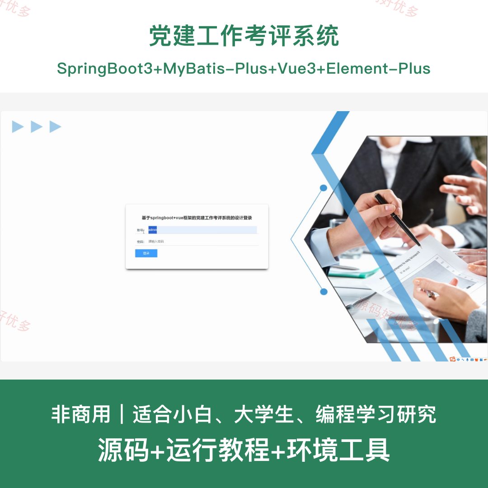
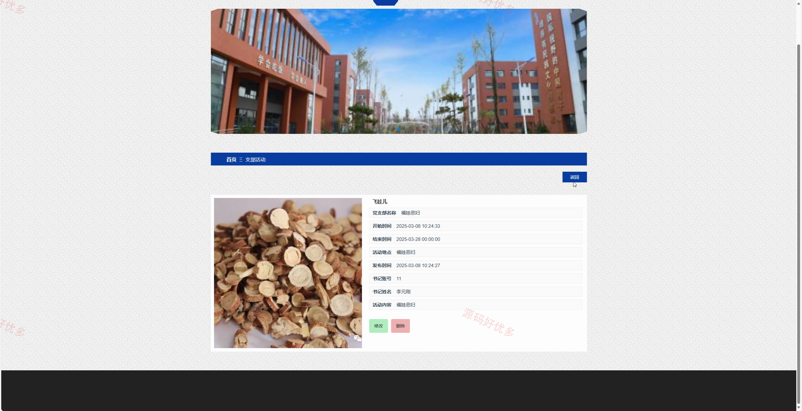
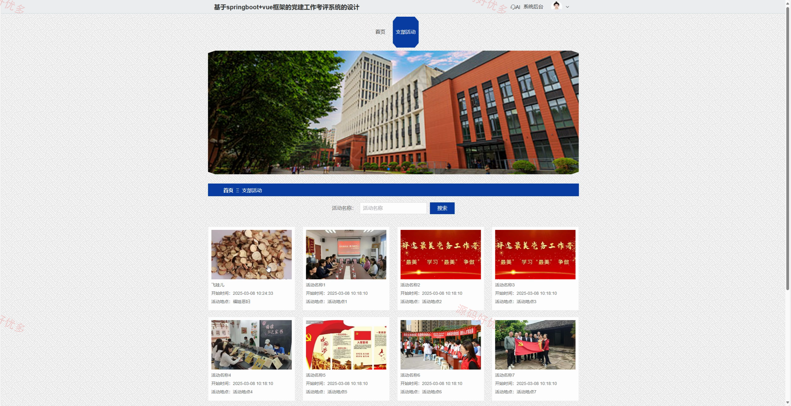
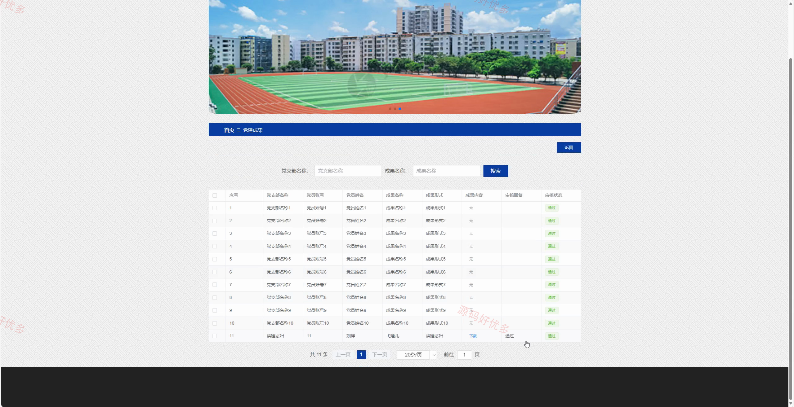
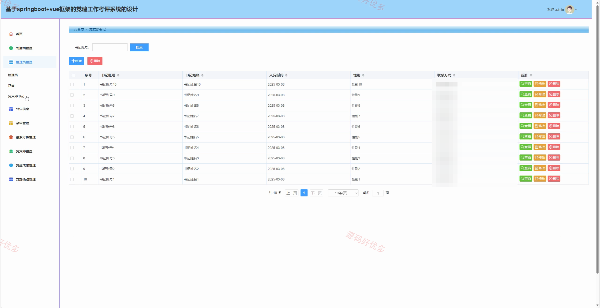
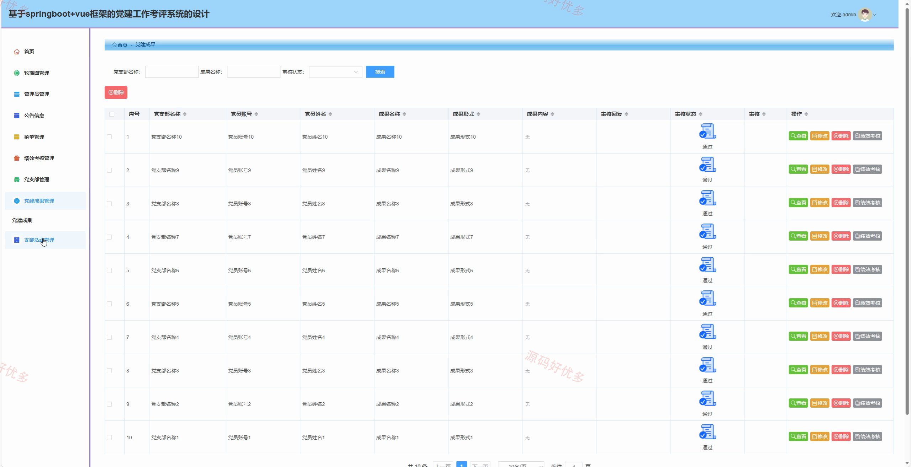
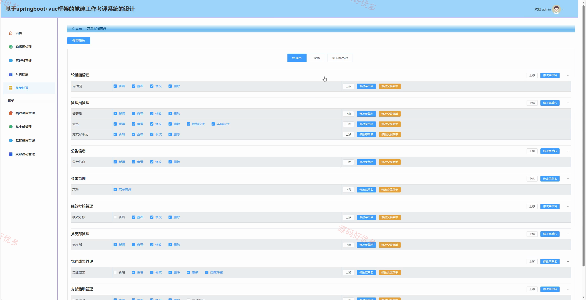
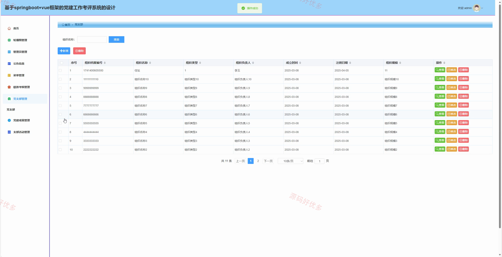

# springbootA576D
springbootA576D党建工作考评系统
## 源码问题查看主页咨询

### 一、关键词
党建工作考评系统、党建工作考评、党建工作考评信息管理、党建工作考评后台管理

### 二、作品包含
源码+数据库+全套环境和工具资源+本地部署教程

### 三、项目技术
前端技术： Html、Css、Js、Vue3.2、Element-Plus
后端技术：Java、SpringBoot3.3.0、MyBatis-Plus

### 四、运行环境（以下版本亲测，其他版本兼容性请自行测试）
开发工具：IDEA/eclipse + VSCODE

数据库：MySQL8.0+（共14张表）

数据库管理工具：Navicat10以上版本

环境配置软件： JDK17 + Maven3.6.3

前端Nodejs：16+

浏览器：谷歌浏览器

### 五、项目介绍
项目编号：springbootA576D

党建工作考评系统面向管理员、党员、党支部书记，提供轮播图管理、管理员管理、公告信息、绩效考核管理、党支部管理、党建成果管理、支部活动管理等功能，实现各角色在系统中的实际业务协作。

角色：管理员、党员、党支部书记

管理员功能：后台登录、轮播图管理、管理员管理、公告信息、菜单管理、绩效考核管理、党支部管理、党建成果管理、支部活动管理。

党员功能：前台登录、前台注册、AI查看、支部活动查看、支部活动活动参与。

党支部书记功能：前台登录、前台注册、AI查看、支部活动查看、支部活动活动参与。

### 六、运行截图

